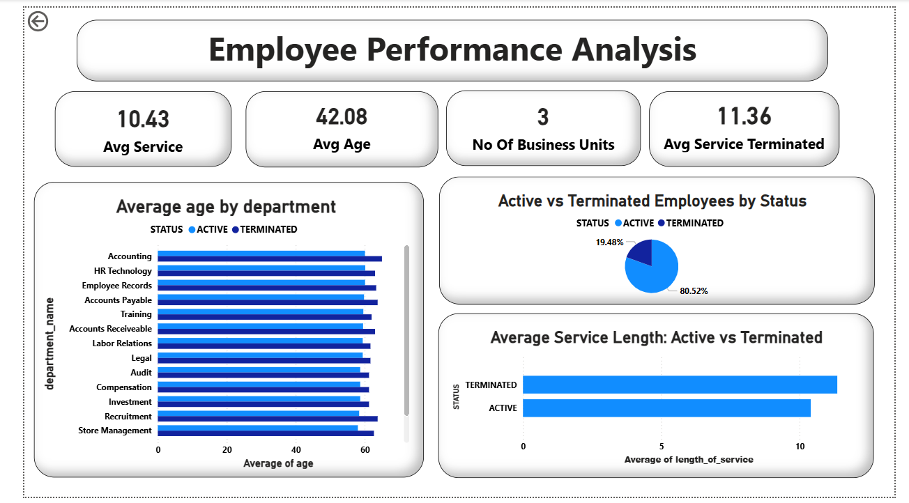
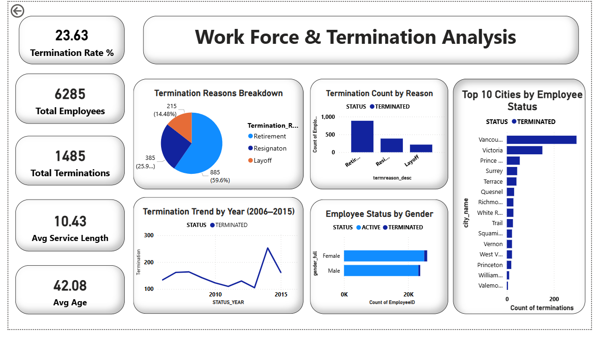

# 📊 Employee Turnover & Workforce Analytics Dashboard

An interactive **Power BI dashboard project** analyzing employee performance, workforce distribution, and termination trends to uncover actionable HR insights.

### Power BI Dashboard | HR Analytics

## Project Overview
Analyzed 49,653 employee records across 10 years (2006-2015)
to identify turnover patterns and at-risk departments.

## project focuses on:
- 📈 Employee performance analysis  
- 👥 Workforce distribution insights  
- 🔄 Employee turnover trends  
- ⚠️ Termination pattern analysis  

## Key Insights
- Total terminations: 1,485 out of 6,285 employees
- Meats department has highest turnover (377 terminations)
- 59% of exits are due to Retirement
- Vancouver city has most terminations
- Terminated employees avg service: 10.4 years

## 🛠️ Tools & Technologies

- Power BI (.pbix)
- Data Visualization
- HR Analytics
- Data Cleaning & Modeling

## Dashboard Screenshots

### 🔹 Employee Performance Analysis

### 🔹 Workforce & Termination Analysis

## 💡 Future Improvements

- Add predictive analytics for attrition  
- Integrate real-time HR data  
- Enhance dashboard interactivity

## Dataset
Source: Kaggle HR Analytics Employee Dataset
